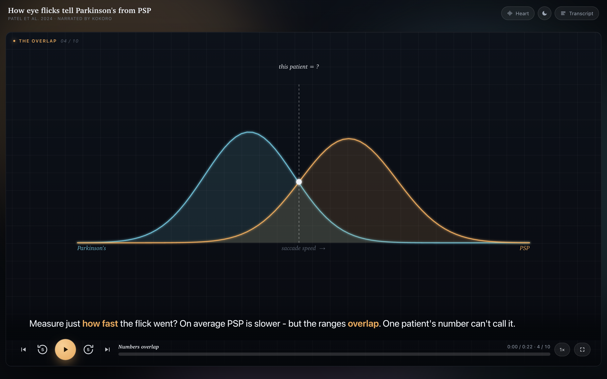

# paper-explainer

[](LICENSE)
[](https://z-ai-danwar.github.io/paper-explainer/)
[](#run-it-yourself)

Turn any research paper or dense concept into a **local, self-narrating, video-style interactive explainer**: a web page you *watch* instead of read.

[](https://z-ai-danwar.github.io/paper-explainer/)

<p align="center"><em><a href="https://z-ai-danwar.github.io/paper-explainer/">▶ Watch this one live</a>: real voice, per-scene animation, word-synced transcript.</em></p>

It plays a real open-source voice (Kokoro TTS, running locally, not the robotic browser voice) narrating the paper scene by scene, with a hand-drawn canvas animation per idea, a transcript that highlights each word as it's spoken, plus speed control, rewind, scrubbing, and fullscreen. The teaching follows the "AI Search" YouTube style: hook with the problem, build tension before the solution, carry the hard idea on one concrete analogy, and name the jargon last.

Everything runs on your machine. Free, offline after the first model download, no API keys.

## ▶ Try it live

**[Open the live demo →](https://z-ai-danwar.github.io/paper-explainer/)** shows the built-in Patel 2024 explainer playing right in your browser: real narrated voice, a per-scene animation, and a transcript that highlights each word as it's spoken. Nothing to install, nothing to run. That is the quality you get out of this repo.

*(The demo is a pre-rendered example; making your own still runs locally, per below.)*

## Give it to your AI agent (easiest way to use it)

You don't have to run anything by hand. Paste this to your coding agent (Claude Code, or similar):

> Clone `https://github.com/Z-ai-dAnwar/paper-explainer` and follow its README to set yourself up, then build me a narrated, animated explainer of `PAPER_TITLE_OR_ARXIV_LINK`. Read the paper, design 8 to 12 scenes in the AI-Search teaching style in `docs/pedagogy.md`, generate the Kokoro narration, build the animated player, and open it. Do all setup yourself; don't ask me to run commands.

The agent handles install, scripting, narration, and animation. You just watch the result.

## Run it yourself

The built-in example's audio ships in the repo (`audio/*.mp3`), so you can just open it:

```bash
open player.html       # Linux: xdg-open · Windows: start (or use the live demo above)
```

Press play. The speed button cycles `0.75x` to `2x`; `J` or the ↺ button rewinds 8s; click the bar to scrub; `F` toggles fullscreen (with a floating transcript window); spacebar and arrows work too.

To **regenerate** the audio (or after you change the narration) you need [Node.js](https://nodejs.org) and, optionally, ffmpeg:

```bash
npm install            # pulls kokoro-js (downloads an ~80MB voice model on first generate)
node generate.mjs      # renders audio/scene-N.wav + timings.js
```

Note: `generate.mjs` emits `.wav`. The committed example is `.mp3` (smaller, for the hosted demo), which is why `scenes.js` sets `window.META.audioExt:"mp3"`. After regenerating to wav, drop that line (or set it to `"wav"`).

The built-in example explains [Patel et al. 2024](https://arxiv.org/abs/2407.16063): classifying Parkinson's vs PSP from eye movements.

## Make your own

1. **Write the narration.** Edit the `scenes` array in `generate.mjs` (one `{id, script}` each), then `node generate.mjs`.
2. **Write the visuals.** Edit `scenes.js` (one `{eyebrow, title, caption, build}` per scene in `window.SCENES`, index-aligned with the narration; set `window.META` for the title/heading). Each `build` receives a `PE` toolkit; call `PE.mkCanvas`, `PE.line`, `PE.grid`, `PE.saccadeY`, `PE.loop`, and so on, instead of reaching into the engine.
3. Open `player.html`.

`player.html` is the **engine** and never needs editing to swap papers; the content lives entirely in `scenes.js` + `timings.js`. That split is what keeps a shared engine safe to reuse across explainers.

Full guides: [`docs/pedagogy.md`](docs/pedagogy.md) (the teaching arc, read this first) and [`docs/scene-authoring.md`](docs/scene-authoring.md) (how to write scenes and animations). An agent-ready, no-repo-needed setup prompt is in [`docs/agent-setup.md`](docs/agent-setup.md).

## How it works

- `generate.mjs` runs [Kokoro-82M](https://huggingface.co/onnx-community/Kokoro-82M-v1.0-ONNX) via [kokoro-js](https://www.npmjs.com/package/kokoro-js) to render each scene's narration to a WAV, and writes `timings.js` with per-word start/end times (used for the karaoke highlight).
- `player.html` is a self-contained, content-free player engine: an `<audio>` element for the voice, a per-scene `<canvas>` stage, and a control layer for speed, rewind, scrub, fullscreen, and transcript. It reads `window.SCENES`, `window.TIMINGS`, and `window.META` from `scenes.js` + `timings.js`, and hands each scene a `PE` drawing toolkit. It runs over `file://`: no server, no build step.
- `scenes.js` is the **content**: the scene visuals + captions for one paper. Swapping papers means swapping this file (plus regenerating `timings.js` and audio); the engine stays put.

## Credits

Voice by [Kokoro](https://huggingface.co/hexgrad/Kokoro-82M) (Apache-2.0). Built with [kokoro-js](https://github.com/hexgrad/kokoro) / Transformers.js.

## License

[MIT](LICENSE) © 2026 Zaid Anwar. The bundled voice model (Kokoro) is Apache-2.0.
